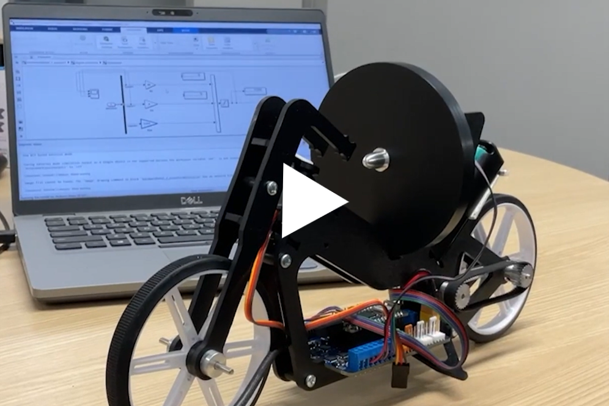

<h2 align="center">Demonstration video</h2>

## Contents:
<ol>
   <li><a href="https://s-nithish-kumar.github.io/Self-Balancing_Motorcycle/#1-objectives">Objectives</a></li>
   <li><a href="https://s-nithish-kumar.github.io/Self-Balancing_Motorcycle/#2-sensors">Sensors</a></li>
   <li><a href="https://s-nithish-kumar.github.io/Self-Balancing_Motorcycle/#3-actuators">Actuators</a></li>
   <li><a href="https://s-nithish-kumar.github.io/Self-Balancing_Motorcycle/#4-self-balancing-motorcycle-kinetics">Self-balancing Motorcycle Kinetics</a></li>
   <li><a href="https://s-nithish-kumar.github.io/Self-Balancing_Motorcycle/#5-implementation">Implementation</a></li>
   <li><a href="https://s-nithish-kumar.github.io/Self-Balancing_Motorcycle/#6-problems-and-troubleshooting">Problems and Troubleshooting</a></li>
   <li><a href="https://s-nithish-kumar.github.io/Self-Balancing_Motorcycle/#7-results-and-conclusion">Results and Conclusion</a></li>
</ol>

### 1. Objectives:
- To build and program a motorcycle that self balances and maneuvers by itself using a flywheel.
- Understand the kinetics of the motorcycle and design a controller for balancing the motorcycle.
- Tune the PID controller to self balance the motorcycle.
+ Balance and move the motorcycle in a straight line and in a circular path.

### 2. Sensors:
- Inertial Measurement Unit for measuring the motorcycle lean angle.
- Rotary encoder, mounted on the inertia wheel motor, to measure velocity of the inertia wheel.
- Rotary encoder, mounted on the rear wheel motor, to measure the velocity of the rear wheel. This sensor is not needed for balance.
+ Battery voltage sensor to measure the battery voltage level and turn the controller off before running out of charge.

### 3. Actuators:
- Inertia wheel motor to drive the inertia wheel.
- Rear wheel motor to drive the rear wheel.
+ Servo motor for steering control.

### 4. Self-balancing Motorcycle Kinetics:

Figure 3 SpeechVive

- The problem of balancing the motorcycle can be considered a problem of controlling an inverted pendulum. As shown in figure 1, when viewed from the rear, it may look like a pendulum rod with an inertia wheel attached to it.
- A is the rotation axis of the revolute joint between the pendulum rod and the ground. In this context, rotation axis A, means the axis going through A and perpendicular to the paper plane. lAD is the length of the pendulum rod, i.e., the length of the motorcycle frame.
- B is the center of mass of the pendulum rod. The pendulum rod is assumed to have a uniform density, which means point B will be in the middle between A and D.
+ C is the rotation axis of the revolute joint between the pendulum rod and the inertia wheel. 
+ After a few mathematical derivations, the following state vector derivative is obtained, which can be used for modeling in Simulink.

Figure 3 SpeechVive

'''
ẋ(t) - Derivative of state vector
θ - Lean angle of the pendulum (rads)
Theta dot - Angular velocity (rad/s)
Theta dot dot -  Angular acceleration (rad/s2)
ω - Rotational speed of the inertia wheel (rad/s)
Omega dot - Rotational acceleration of the inertia wheel (rad/s2)
mr - Mass of pendulum rod (kg)
mw - Mass of inertia wheel (kg)
lAB - Distance from ground to the center of mass of the pendulum rod (m)
lAC - Distance from ground to the center of mass of the inertia wheel (m)
lAD - Length of the pendulum rod (m)
𝜏m - Motor torque (Nm)
'''

### 5. Implementation:
#### Steps:
1. Using the state vector derivative, the inverted pendulum model is developed with Simulink, as shown below in Figure . Initially, when no motor torque is applied, the pendulum oscillates freely, as seen in Figure . When motor torque is applied, which is provided as feedback of the pendulum angle, the pendulum oscillates in the upright position, as depicted in Figures x and y, respectively.
2. A PID controller is added to further increase the stability of the inverted pendulum and maintain a zero degree lean angle. The simulink model with PID controller and the output of the model is shown in figures and, respectively.

### 7. Implementation:
#### Circuit Diagram:

Figure 5 Circuit diagram

- The circuit diagram above shows the components used in the device.An adjustable-gain microphone is used as 
a user microphone. The gain of the user microphone is optimized so that it will only capture the user's voice 
and eliminate ambient noise.
+ Though the gain is optimized, the user's microphone will capture some background noise, but it is negligible.
A bone conduction microphone with better sensitivity can help overcome this problem. The bone conduction microphone
can be placed on top of the collarbone, where the sensitivity is better.
* An Auto-gain microphone is used as an ambient microphone. The gain of this microphone adjusts automatically and
is directly proportional to the distance of the sound source. Hence, this microphone is effective at capturing
background noise that is far away.
- Buttons are provided to adjust the intensity of the vibration motor.

#### Working:

Figure 6 Overall sequence flow diagram

- Once the device is turned on, the ambient mic will capture background noise. When the user starts speaking,
the captured background noise is used for comparison with the user’s voice level and provides feedback. The
sequence flow diagram above illustrates the feedback logic of the device.
+ The logic has three different states: high, normal, and low for the user’s voice level, and two discrete
states: noise and no noise for background noise.
* When the user speaks at a low volume, irrespective of ambient noise, continuous vibrotactile feedback will
be generated.
+ When there is no background noise and the user converses in a normal voice, no feedback is provided. But if
the user is conversing in a normal voice in the presence of background noise, continuous feedback will be provided.
- If the user speaks at a high volume in the absence of ambient sound, intermittent vibrotactile feedback will be
provided, prompting the user to reduce their volume. But if ambient noise is present and the user speaks at a high
volume, feedback is not provided.

Figure 7 Detailed sequence flow diagram

#### Microphone Signal Filtering:
Signals from both user and ambient microphones are filtered using first-order low-pass filters to remove noise 
and avoid sudden spikes that could affect the feedback of the device.

Figure 8 Raw and filtered user microphone signals

Figure 9 Raw and filtered ambient microphone signals

#### Component Housing:

Figure 10 Component housing

As shown in the figure above, all the components are placed inside 3D printed boxes.

Figure 11 Shoulder brace

- The shoulder brace shown above is modified to incorporate the device onto the interior surface of the
brace, ensuring that it remains hidden from view. Additionally, the device is removable, allowing users
to detach it during washing, and the shoulder brace is lightweight and flexible to make the user comfortable.
+ The box containing the vibration motor, Battery Management System, ambient microphone, and controller will
be placed inside the shoulder brace, and the brace can be worn on either shoulder.
* The user's microphone placed on top of the collarbone will pick up the user's vocal intensity.
+ Signals from both microphones are filtered using a low-pass filter to avoid spikes. Both these signals are
used in determining the user's and ambient sound levels for providing feedback.
- The intensity of the vibration motor can be adjusted using the buttons provided based on the user’s convenience.
The device comes with a rechargeable battery and a battery life of 12 hours on a single charge.
* The primary aim of designing the device is to ensure user-friendliness and accessibility with minimal effort
and disturbance to the wearer. The shoulder brace is adjustable to accommodate all body types comfortably.

Figure 12 Shoulder brace under regular attire

As shown in the figure above, the shoulder brace is hidden under regular attire.

### 8. Testing and Validation:
- The device was tested with four people with varying voice levels.
- The user is asked to position the user microphone at the appropriate position near the face, and the ambient
microphone is placed on the shoulder. The user is made to speak at three different voice levels: low, medium,
and high.
-  As said before, all the users have significantly varying voice levels, and the device can provide proper
feedback to different users with varying voice and ambient sound levels. It showed that the device could
be used by a wide.
+ However, tuning the device for each specific user enhances the accuracy of the feedback provided by the device.

### 9. Problems and Troubleshooting:
- The auto-gain microphone, which is used for capturing background noise, provides negative values for certain
periods of time when there is a sudden change in the sound level. This has a huge negative impact on feedback.
To overcome this problem, a counter is added, which makes the controller more stable, but this increases the
feedback delay to some extent.
+ Though the gain of the user microphone is set to minimum to capture only the user’s voice, at higher background
noise levels it captures some of the ambient noise, which affects the feedback. The user's microphone is surrounded
by a sponge material to reduce the intensity of the noise captured by it.
* Even if the user speaks in a normal voice, at the start and end of each word, the voice level falls below the
low band level of the controller. This triggers the controller to provide false feedback. Counters are used to
overcome this problem, but with a slight increase in feedback delay.

### 10. Results and Conclusion:
- The device was found to perform with reasonable accuracy and delay for a range of people with varying voice levels.
- Replacing the electret microphone with a bone conduction microphone for the receiving user’s voice will help in
avoiding ambient noise.
+ From the testing, it has been found that tuning the device for each user will improve the accuracy and response
time of the device.
* The shoulder is tested with people of varying body sizes and shapes and is found to be comfortable for
day-to-day activities.

### 11. References:
1. A. Saika, M. Hussain, A. Barua, And S. Paul, “Smart Healthcare For
Disease Diagnoses And Prevention”, An Insight Into Parkinson’s
Disease: Research And Its Complexities, 1st Ed., pp. 59-80, January
2020.
2. “Who Has Parkinson’s?” Parkinson’s Foundation, [Online]: Statistics
| Parkinson's Foundation. [Accessed: 01-Jan-2023].
3. Parkinson’s Foundation, Speech Therapy and PD [online]:
https://www.parkinson.org/library/fact-sheets/speech-therapy.
4. My.Clevelandclinic.Org/Health/Diseases/9392-Speech-Therapy-For-
Parkinsons-Disease.
5. Cynthia M. Fox, Lorraine Olson Ramig, “Vocal Sound Pressure Level
and Self-Perception of Speech and Voice in Men and Women with
Idiopathic Parkinson Disease”, American Journal of Speech-Language
Pathology, vol. 6, no. 2, pp. 85-95, May 1997.
6. Andrew Ma, Kenneth K Lau, Dominic Thyagarajan, “Voice changes
in Parkinson’s disease: What are they telling us?”, Journal of Clinical
Neuroscience, vol. 72, pp. 1-7, Feb 2020.
7. Ramig, L.O., et al., Comparison of two forms of intensive speech treatment for Parkinson disease. Journal of Speech and Hearing Research, 1995. 38: pp. 1232-1251.
8. DeLetter, M.P., et al., Levodopa-induced alterations in speech rate in
advanced Parkinson’s disease.Acta NeurologicaBelgica, 2006. 106: pp. 19-22.
9. Brin, M.F., et al., Dysphonia due to Parkinson's disease, pharmacological, surgical, and behavioral management perspectives, in Vocal rehabilitation for Medical Speech-Language Pathology, By Clinicians, For Clinicians, C.M. Sapienzaand J. Casper, Editors. 2004, Pro-Ed: Austin, TX. pp. 209-269.
10. Fox, C.M., et al., Current perspectives on the Lee Silverman Voice
Treatment Program (LSVT®) for individuals with idiopathic Parkinson's
disease.American Journal of Speech-Language Pathology, 2002. 11: pp. 111-123.
11. P. B. Shull and D. D. Damian, “Haptic wearables as sensory replacement, sensory augmentation and trainer – A Review,” Journal of NeuroEngineering and Rehabilitation, vol. 12, no. 1, 2015.
12. M. D. Andreetta, S. G. Adams, A. D. Dykstra, and M. Jog, “Evaluation of Speech Amplification Devices in Parkinson’s Disease,” American Journal of Speech-Language Pathology, vol. 25, no. 1, pp. 29–45, Feb. 2016, doi:
https://doi.org/10.1044/2015_AJSLP-15-0008.
13. Thomas Kehoe, “Device for self-monitoring of vocal intensity”, United
States Patent 0183964, Aug. 17, 2006.
14. Kehoe Thomas David, “Biofeedback System for Speech Disorders”,
United States Patent 5794203, Aug. 11, 1998.
15. https://learn.adafruit.com/adafruit-qt-py-2040/overview.

